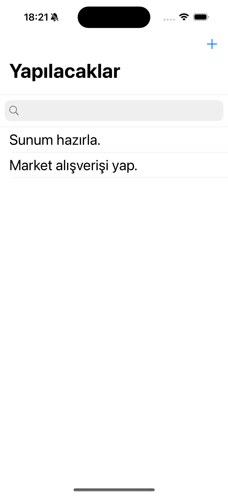
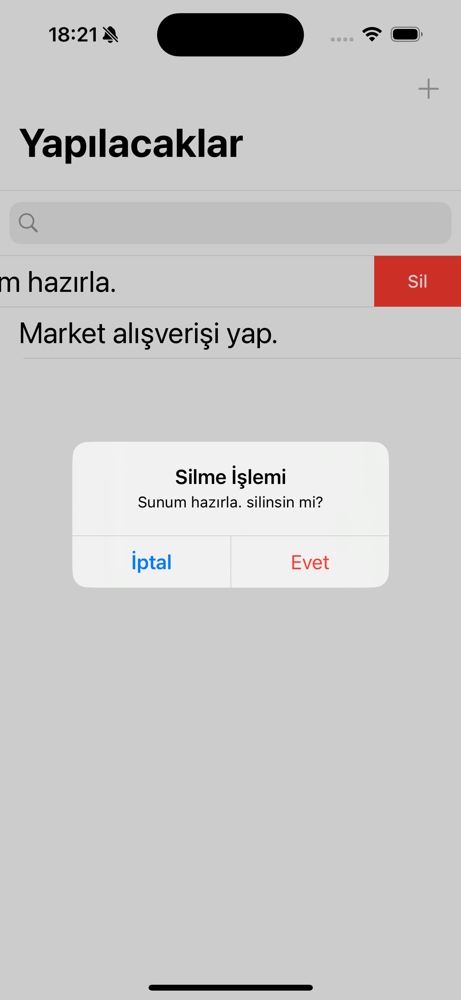

# Homework 2 - To-Do App

---

Bu ödevde, UIKit kullanılarak basit bir yapılacaklar listesi (To-Do) uygulaması geliştirildi.

## Özellikler

- Yapılacakları listeleme  
- Arama (UISearchBar)  
- Yeni görev ekleme  
- Görev silme (UIAlert ile onaylı)  
- Görev güncelleme  
- Sayfalar arası geçiş (Segue)

 

  
  &nbsp;&nbsp;&nbsp;
  
    
  
  &nbsp;&nbsp;&nbsp;
  

